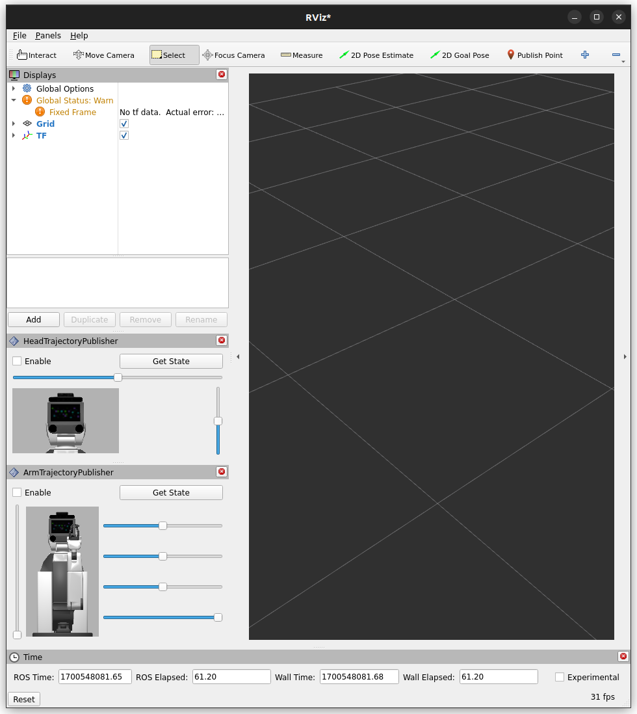

# hsr_trajectory_publisher_gui

rviz2からHSRの各関節の目標値を送るツール  
主に動作確認用

## 使い方
Enableにチェックを入れている時のみ目標値がpublishされる。トピック名は以下
- ```/head_trajectory_controller/joint_trajectory``` 
- ```/arm_trajectory_controller/joint_trajectory```

Get Stateボタンをクリックするとスライダーの値を現在の関節の値に設定できる。参照するトピック名は以下
- ```/joint_states```

